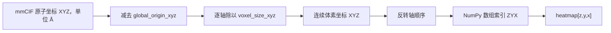
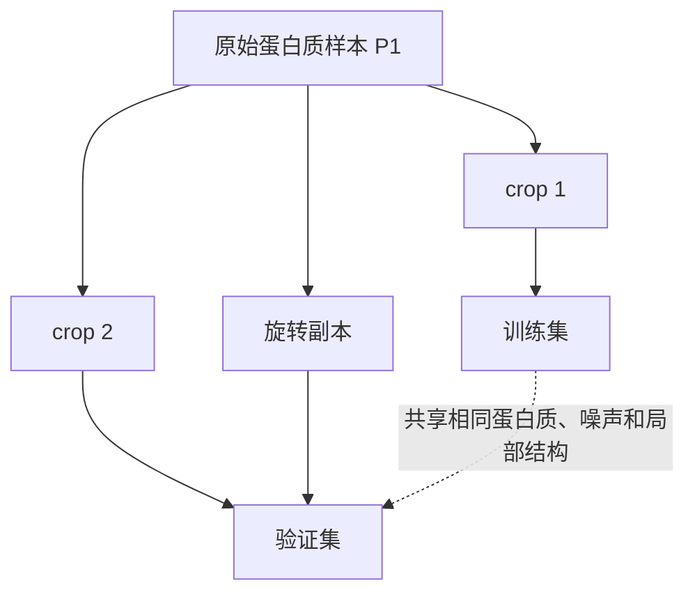
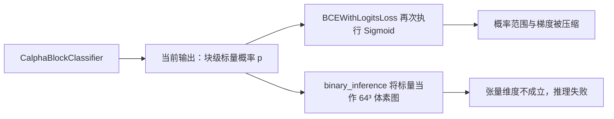
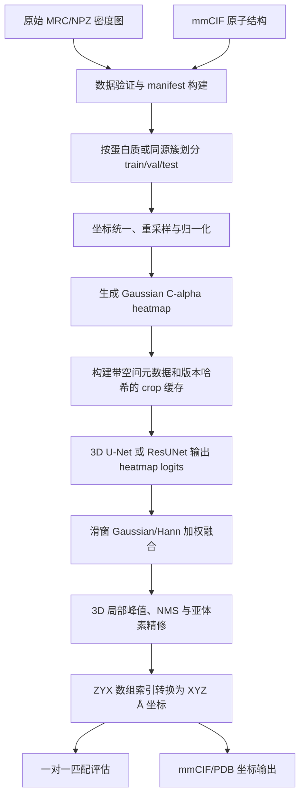
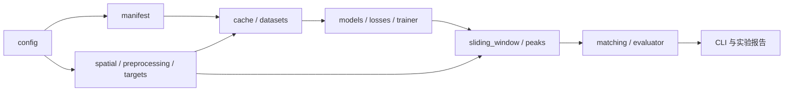
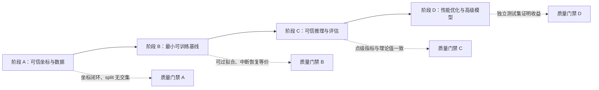

# Calpha 冷冻电镜 C-alpha 分割程序问题分析与重构报告

## 1. 文档信息

- 审查对象：`FlowerHen/cyroEM_Catom_segment` 仓库中的 `Calpha` 子目录
- 审查提交：`86503a9efd7926aa0d5ea479747f8ca06e30fde3`
- 审查范围：数据读取、坐标转换、标签生成、数据增强、缓存、模型、训练器、块分类器、滑窗推理、后处理、评估、配置、调试脚本和工程可复现性
- 审查方法：逐文件静态审查、Python 语法编译、YAML 解析、未定义名称检查、模块接口比对，以及与 CryFold/MRC 坐标约定的交叉核验

本报告不把问题仅仅视为软件缺陷。对于冷冻电镜中的 C-alpha 定位任务，代码中的坐标、抽样、标签、损失和评估共同定义了一个统计实验。只要其中任一环节改变了空间含义、训练集与验证集的独立性或预测对象的数学定义，即使程序能够运行，也可能得到没有科学解释力的指标。

---

## 2. 执行摘要

当前程序存在三类根本性问题：

1. **科学语义错误**：原子世界坐标 `x,y,z` 与体素数组索引 `z,y,x` 混用，使监督标签和输出坐标发生轴置换；部分所谓旋转实际为镜像反射，会改变蛋白质手性。
2. **统计实验错误**：数据在生成 crop 和旋转副本后才随机划分，导致同一蛋白质的高度相关样本同时进入训练集和验证集；验证指标不能代表对新蛋白质的泛化能力。
3. **程序契约错误**：块分类器输出块级标量概率，但训练器把它当 logits，推理器又把它当三维体素掩码；训练、推理和评估并没有共享同一个输出定义。

因此，当前仓库即使产生 checkpoint 和验证曲线，也不能直接据此判断模型是否学会了 C-alpha 定位。建议先修复空间坐标、数据划分和输出契约，再讨论模型结构或调参。

### 2.1 严重度概览

| 编号 | 问题 | 严重度 | 主要后果 |
|---|---|---:|---|
| P0-01 | XYZ 与 ZYX 坐标混用 | 阻断科研结论 | 标签位置错误，世界坐标输出错误 |
| P0-02 | 块分类器概率/logits 混淆 | 阻断训练正确性 | 损失函数输入不符合定义，梯度失真 |
| P0-03 | 块级标量被当作体素图 | 阻断推理 | 维度错误，二分类推理不能运行 |
| P0-04 | 缺失模块、拼写错误、未定义名称 | 阻断运行 | 训练或评估入口直接失败 |
| P1-01 | crop 级随机划分造成数据泄漏 | 高 | 验证指标显著虚高 |
| P1-02 | 配置结构与读取逻辑不一致 | 高 | 增强失效或产生未配置行为 |
| P1-03 | 旋转集合包含镜像 | 高 | 引入非物理的蛋白质对映体 |
| P1-04 | 梯度累积和 OneCycle 恢复错误 | 高 | 训练崩溃或学习率轨迹错误 |
| P1-05 | 评估忽略实际空间元数据 | 高 | Å 尺度距离指标无效 |
| P1-06 | 滑窗融合和归一化不一致 | 高 | 接缝、阈值漂移和推理偏差 |
| P1-07 | 缓存缺乏空间起点和版本 | 高 | 无法可靠回映世界坐标，旧缓存污染实验 |
| P2-01 | 损失设计与极端类别不平衡不匹配 | 中 | 训练不稳定，概率校准差 |
| P2-02 | 点提取使用全体素 MeanShift | 中 | 时间和内存复杂度过高 |
| P2-03 | 点级评估不是一对一匹配 | 中 | 重复预测仍可能获得较高指标 |
| P2-04 | 无依赖锁定、CLI、测试和缓存清单 | 中 | 无法复现实验或验证修复 |

---

## 3. 程序真正需要解决的科学问题

### 3.1 任务定义

冷冻电镜密度图可以表示为离散标量场：

$$
V[i_z,i_y,i_x] \in \mathbb{R}
$$

其中每个体素存储该空间位置附近的电子散射密度。C-alpha 定位的目标不是一般意义上的前景分割，而是从密度场中恢复一组离散三维点：

$$
\mathcal{P}
=
\left\{
\mathbf{p}_r=(x_r,y_r,z_r)
\;\middle|\;
r \text{ 为蛋白质残基}
\right\}
$$

每个标准氨基酸残基通常有一个 C-alpha 原子。相邻残基的 C-alpha 间距通常约为 3.8 Å，这一骨架几何约束对后处理、匹配阈值和结果合理性检查都很重要。

因此，更精确的计算目标应当是：

1. 预测每个体素成为 C-alpha 中心附近位置的概率或响应强度；
2. 从连续响应图中提取有限个局部峰值；
3. 将峰值从数组索引转换成世界坐标；
4. 使用一对一空间匹配评价预测点和真实原子点。

把任务称为“分割”是可以的，但必须明确网络输出本质上是用于点检测的三维 heatmap，而不是一个普通的体积前景区域。


### 3.2 建议的数学对象

对于真实 C-alpha 坐标 $\mathbf{p}_r$，建议使用高斯热图作为监督：

$$
H(\mathbf{q})
=
\max_r
\exp\!\left(
-\frac{\lVert \mathbf{q}-\mathbf{p}_r \rVert_2^2}{2\sigma^2}
\right)
$$

或使用多个高斯贡献的截断和：

$$
H(\mathbf{q})
=
\min\!\left(
1,
\sum_r
\exp\!\left(
-\frac{\lVert \mathbf{q}-\mathbf{p}_r \rVert_2^2}{2\sigma^2}
\right)
\right)
$$

这里的距离必须在物理空间中计算，即单位为 Å，而不是简单地假设每个轴的体素大小均为 1。$\sigma$ 可以根据地图分辨率和 voxel size 设定。硬标签可以保留用于点中心约束或指标，但不应成为唯一监督，因为单体素正类会造成极端不平衡，并对亚体素误差非常敏感。

---

## 4. 问题一：世界坐标与数组坐标混用

### 4.1 原理

蛋白质结构文件中的原子坐标通常按笛卡尔世界坐标 $x,y,z$ 表示，单位为 Å。NumPy 从 MRC 读取的三维数组通常按 `section,row,column` 排列；经过标准轴整理后，对应 $z,y,x$。

令世界坐标为：

$$
\mathbf{p}_{xyz}=(x,y,z)
$$

令地图原点为 $\mathbf{o}_{xyz}$，体素大小为 $\mathbf{s}_{xyz}=(s_x,s_y,s_z)$，则连续体素坐标为：

$$
\mathbf{u}_{xyz}
=
\frac{\mathbf{p}_{xyz}-\mathbf{o}_{xyz}}{\mathbf{s}_{xyz}}
$$

这里的除法表示逐轴相除。

NumPy 数组索引必须反转为：

$$
\mathbf{i}_{zyx}=(u_z,u_y,u_x)
$$

也就是说，正确关系不是 $\operatorname{grid}[x,y,z]$，而是 $\operatorname{grid}[z,y,x]$。

CryFold 自身的 `atom2map` 也明确先得到 $(k,j,i)=(x,y,z)$ 的离散坐标，然后返回 $(i,j,k)$ 作为数组索引。这与 MRC 数据的内存排列一致。



### 4.2 当前代码逻辑

[`Calpha/dataset/preprocess.py`](Calpha/dataset/preprocess.py#L51) 中：

```python
grid_indices = ((ca_coords - grid_data['global_origin']) /
                grid_data['voxel_size']).astype(int)
...
hard_label[tuple(idx)] = 1.0
```

`ca_coords`、`global_origin` 和 `voxel_size` 都是 `x,y,z` 顺序，因此 `grid_indices` 仍为 `x,y,z`。代码却直接把它交给 NumPy，NumPy 会把三个值解释为 `z,y,x`。

软标签也有同样问题：

```python
grid_points = np.stack(np.indices(grid_shape), axis=-1) * voxel_size + origin
```

`np.indices` 生成的是 `z,y,x`，代码却直接与 `x,y,z` 的 voxel size 和 origin 运算。因此 KDTree 查询点的世界坐标也是轴错位的。

后处理中的 [`Calpha/inference/postprocess.py`](Calpha/inference/postprocess.py#L26) 再次执行：

```python
return self.origin + indices * self.voxel_size
```

`np.argwhere` 返回 `z,y,x`，这里却将其当成 `x,y,z`。于是即使网络预测位置完全正确，导出的世界坐标仍然错误。

### 4.3 `astype(int)` 的额外数值问题

NumPy 将浮点数转换为整数时采用向零截断，而不是四舍五入：

- $0.9 \rightarrow 0$
- $-0.9 \rightarrow 0$

因此，位于原点负方向、但距离不到一个体素的原子可能被错误地映射到索引 0，并通过非负边界检查。对于中心点标签，通常应使用 `np.rint` 选择最近体素；如果定义的是包含关系，则应明确使用 `floor`，而不能隐式依赖向零截断。

### 4.4 计算后果

假设真实原子对应体素坐标 $(x,y,z)=(10,20,30)$，当前程序会在数组索引 $(10,20,30)$ 写标签，而正确数组位置应为 $(z,y,x)=(30,20,10)$。网络接收到的密度局部结构与监督位置不再空间对齐。

这不是一个模型可以通过增加容量自动修复的问题。卷积网络具有局部感受野和平移等变性，它无法仅根据 $(30,20,10)$ 附近的密度去预测远处 $(10,20,30)$ 的标签，除非数据尺寸和结构产生偶然对称或网络利用边界位置记忆数据集。

### 4.5 生物学后果

错误轴顺序会破坏原子和电子密度之间的物理对应关系。训练结果不再表示“在 C-alpha 密度处产生峰值”，而可能退化为位置先验、数据集形状先验或噪声拟合。任何后续的骨架连接、残基间距检查和 CIF 输出都失去生物学意义。

### 4.6 最佳实践

集中定义且只定义一次空间转换函数：

```python
def world_xyz_to_index_zyx(points_xyz, origin_xyz, voxel_size_xyz):
    voxel_xyz = (points_xyz - origin_xyz) / voxel_size_xyz
    return np.rint(voxel_xyz[:, ::-1]).astype(np.int64)

def index_zyx_to_world_xyz(indices_zyx, origin_xyz, voxel_size_xyz):
    return origin_xyz + indices_zyx[..., ::-1] * voxel_size_xyz
```

所有标签、缓存、推理和评估必须调用同一实现。变量名中显式包含 `_xyz` 或 `_zyx`，避免使用含义不明的 `indices`、`coords`。

### 4.7 验收测试

1. 构造非立方体体积，例如 $(D,H,W)=(7,11,13)$。
2. 使用非各向同性体素大小 $(1.1,1.3,1.7)$ 和非零原点。
3. 将已知 `xyz` 点转换为 `zyx` 索引，再反变换。
4. 要求往返误差每轴不超过半个体素。
5. 在对应数组位置放置唯一脉冲，确认标签与密度脉冲完全重合。

---

## 5. 问题二：数据划分发生在 crop 之后，造成验证泄漏

### 5.1 统计原理

监督学习验证集必须近似来自与训练集独立的样本。这里真正的独立实验单位是蛋白质地图或结构条目，而不是从同一地图裁出的 64 立方体。

同一地图中的相邻 crop 通常具有：

- 重叠体素；
- 相同分辨率、噪声模型和归一化统计；
- 相同蛋白质折叠和局部二级结构；
- 相同采集和重建伪影；
- 旋转增强前完全相同的原始信号。

设两个 crop 的相关系数为 $\rho$。即使形式上有 $n$ 个 crop，其有效独立样本量也会显著小于 $n$。在一个简化的等相关模型中，有效样本量近似为：

$$
n_{\mathrm{eff}}
\approx
\frac{n}{1+(n-1)\rho}
$$

当同一蛋白质的 crop 同时进入训练和验证时，验证集测量的主要是模型对同一地图局部模式的记忆，而不是对未见蛋白质的泛化。



### 5.2 当前代码逻辑

[`Calpha/dataset/dataset.py`](Calpha/dataset/dataset.py#L154) 先构造完整的 crop 数据集，然后执行：

```python
train_dataset, val_dataset = random_split(full_dataset, [train_size, val_size])
```

缓存文件同样按单个 crop 进入 `PrecachedCryoEMDataset`，再执行随机切分。这意味着：

- 同一原始蛋白质的相邻窗口可能分到两侧；
- 同一窗口的多个旋转版本可能分到两侧；
- 同一数据处理批次的伪影被两侧共享。

非缓存模式还用 `CryoEMDataset(config, mode='train')` 创建唯一数据集，训练集和验证集只是它的两个 `Subset`。因此验证访问 `__getitem__` 时仍会执行训练增强。

块分类器试图按文件名分组，但分组解析没有可靠去除旋转和空块后缀。例如 `sample_c0_r0.npz` 与 `sample_c0_r1.npz` 可能生成不同的分组键，不能保证来自同一原始样本的文件保持在同一集合。

### 5.3 生物学与实验后果

蛋白质局部骨架片段具有强重复性，但不同蛋白质、不同分辨率和不同重建条件之间仍存在显著域差异。crop 泄漏会掩盖这些差异，导致：

- 验证 F1/IoU 高于真实部署性能；
- 阈值在验证集上表现良好，但对新地图失效；
- 不同模型或损失函数之间的比较缺乏可信度；
- 早停选择的是“最适合同一批地图”的 checkpoint。

### 5.4 最佳实践

先建立原始样本 manifest：

```text
sample_id, npz_path, cif_path, resolution, voxel_size, split
```

然后按 `sample_id` 或更严格的同源簇划分：

1. `train/val/test` 在蛋白质层面互斥；
2. 划分完成后才生成窗口；
3. 所有旋转、噪声和尺度版本继承原始样本的 split；
4. 如果存在高序列同源蛋白质，应按序列簇或结构簇分组，避免同源泄漏；
5. 记录随机种子和最终清单，不依赖 `os.listdir` 顺序。

### 5.5 验收测试

- 任意 `sample_id` 只能出现在一个 split。
- 任意缓存文件都必须携带 `source_sample_id`。
- CI 检查 train/val/test 的样本 ID 交集为空。
- 验证数据集对象必须明确 `augment=False`。

---

## 6. 问题三：增强配置、实现和缓存行为不一致

### 6.1 配置契约原理

配置文件是实验定义的一部分。一个配置键只有在以下条件同时满足时才有意义：

1. schema 对键的名称、类型、范围和单位有明确约束；
2. 运行代码从同一路径读取该键；
3. 日志记录最终解析后的有效值；
4. checkpoint 和缓存记录配置哈希；
5. 未知键或拼写错误必须报错，而不是静默使用默认值。

如果配置读取失败后自动回退默认值，实验人员看到的配置与实际执行行为会不同，这比直接报错更危险。

### 6.2 当前代码逻辑

YAML 使用嵌套结构：

```yaml
augmentation:
  rotation:
    rotation_samples: 1
  noise:
    prob: 0.3
```

`VolumeAugmentor` 正确读取这些嵌套字段，但：

- [`data_cache_generator.py`](Calpha/dataset/data_cache_generator.py#L44) 读取 `augmentation.rotation_samples`；
- [`block_dataset.py`](Calpha/dataset/block_dataset.py#L165) 读取 `augmentation.rotation_samples`、`augmentation.noise_prob`；
- [`dataset_cache.py`](Calpha/dataset/dataset_cache.py#L19) 只有 `augmentation.enabled=True` 才启用增强，但现有 YAML 没有该字段；
- `start_training_block.py` 还包含 `intensity_inverpsion` 拼写错误。

结果不是单纯“某些增强没有发生”：

- 缓存生成时旋转数通常被解析为 0；
- 分割训练使用缓存时在线增强完全关闭；
- 块分类器读取不到 `noise.prob`，反而使用代码默认值 0.5；
- 块分类器加噪后把体积裁剪到 `[0,1]`，但上游没有保证密度已归一化到这个范围。

### 6.3 计算影响

错误裁剪会执行：

$$
V'
=
\min\!\left(1,\max\!\left(0,V+\varepsilon\right)\right)
$$

如果原始地图经过零均值标准化，负密度是有效信号的一部分。上述操作会把全部负值压成 0，把大于 1 的高密度压成 1，导致非线性饱和和信息丢失。训练分布与分割模型或推理输入分布也会进一步分离。

### 6.4 最佳实践

使用 dataclass、Pydantic 或 OmegaConf 的结构化 schema，并禁止未知字段。例如：

```yaml
augmentation:
  enabled: true
  rotation:
    probability: 0.5
    count: 1
  gaussian_blur:
    probability: 0.3
    sigma_angstrom: [0.8, 1.2]
  gaussian_noise:
    probability: 0.3
    std_fraction: [0.01, 0.05]
```

增强参数应说明物理单位。模糊 sigma 如果定义在体素单位，在不同 voxel size 的地图上代表不同的物理尺度；更稳妥的方式是先以 Å 定义，再除以各轴 voxel size 转为数组 sigma。

### 6.5 验收测试

- 所有配置文件能通过严格 schema 校验。
- 拼写错误或未知键必须终止启动。
- 固定随机种子后，对增强的触发次数和参数做统计测试。
- 日志打印最终解析配置，而非原始 YAML。
- 训练、验证和推理各自明确记录是否启用增强。

---

## 7. 问题四：所谓立方体旋转包含镜像反射

### 7.1 数学原理

三维刚体旋转属于特殊正交群 $\mathrm{SO}(3)$：

$$
R^{\mathsf T}R=I,
\qquad
\det(R)=+1
$$

一般正交变换属于 $\mathrm{O}(3)$，其中 $\det(R)=-1$ 的元素是反射或旋转与反射的组合。立方体确实有 24 个保持取向的旋转对称，但这些变换都必须满足 $\det(R)=+1$。

仅仅枚举 6 种轴排列再加 4 次平面 `rot90`，会保留轴排列的奇偶性。奇排列的行列式为 $-1$，因此其中一半变换是镜像，不是旋转。

### 7.2 当前代码逻辑

[`Calpha/dataset/cube_rotation.py`](Calpha/dataset/cube_rotation.py#L12) 枚举 6 个 `np.transpose` 轴排列，再对后两个轴执行 0、90、180、270 度旋转。代码没有检查变换矩阵的 determinant，也没有增加必要的轴翻转以把奇排列修正为右手坐标系。

### 7.3 生物学原理

天然蛋白质主要由 L-氨基酸构成，蛋白质骨架和侧链具有确定手性。镜像后的密度在几何上对应对映结构，通常不属于真实数据分布。虽然低分辨率局部密度可能看起来近似对称，但引入镜像会迫使模型把真实和非真实手性模式视为等价。

对于只检测 C-alpha 中心的粗粒度任务，镜像的危害可能小于侧链建模，但它仍会改变螺旋手性和局部骨架走向，不应作为未经论证的默认增强。

### 7.4 最佳实践

- 预生成 24 个整数旋转矩阵，并断言 $R^{\mathsf T}R=I$、$\det(R)=1$。
- 用 `permute + flip` 实现，不使用不能证明正确的排列组合。
- 对体积、硬标签、软标签使用同一变换。
- 如果地图 voxel size 各向异性，应先重采样到等体素再做任意轴交换，否则旋转会改变物理尺度。

### 7.5 验收测试

- 恰好生成 24 个互不相同的矩阵。
- 每个矩阵 determinant 都为 $+1$。
- 对带方向标记的测试体积旋转四次后恢复原状。
- 世界坐标中的点和体素峰值经过同一旋转后仍重合。

---

## 8. 问题五：块分类器的概率、logits 和空间输出定义冲突

### 8.1 logits 与概率的数学原理

二分类网络通常输出 logit $z\in\mathbb{R}$，概率由 Sigmoid 给出：

$$
p
=
\sigma(z)
=
\frac{1}{1+e^{-z}}
$$

二元交叉熵为：

$$
\mathcal{L}_{\mathrm{BCE}}
=
-\left[
y\log p+(1-y)\log(1-p)
\right]
$$

`BCEWithLogitsLoss` 将 Sigmoid 和 BCE 合并，并使用 log-sum-exp 技巧避免 $p$ 接近 0 或 1 时的数值下溢。其输入必须是未经过 Sigmoid 的 $z$。

当前模型先返回 $p=\sigma(z)$，训练器再把 $p$ 当作 logit。损失内部实际使用：

$$
\sigma(p)=\sigma\!\left(\sigma(z)\right)
$$

由于 $p\in[0,1]$，第二次 Sigmoid 的输出只能位于 $[0.5,\sigma(1)]\approx[0.5,0.7311]$。这严重压缩概率范围，使负类很难得到接近 0 的预测，并改变梯度尺度。

### 8.2 当前代码逻辑

[`Calpha/model/block_classifier.py`](Calpha/model/block_classifier.py#L58) 返回：

```python
return self.sigmoid(out).squeeze(-1)
```

训练器在 [`block_classifier.py`](Calpha/model/block_classifier.py#L121) 使用 `BCEWithLogitsLoss`，计算指标时又调用一次 `torch.sigmoid(outputs)`。推理器也重复调用 Sigmoid。

### 8.3 标量输出与体素图冲突

块分类器的定义是判断整个 $64^3$ crop 是否包含 C-alpha，因此输出形状应为 $[B]$ 或 $[B,1]$。然而 [`binary_inference.py`](Calpha/inference/binary_inference.py#L54) 将预测结果切成：

```python
binary_pred[:crop_i, :crop_j, :crop_k]
```

这要求 `binary_pred` 是三维数组。当前模型输出是标量，因此接口在数学含义和张量维度上都不成立。



### 8.4 背景噪声估计的逻辑错误

`compute_background_noise` 把块级预测转换成 `block_mask`，随后尝试索引 `block_mask[i,0]` 并将其当作 `[D,H,W]` mask。块级分类不能告诉程序块内哪些体素属于背景，所以无法据此计算空间背景噪声。

如果预测为“空块”，可以计算整个 crop 的 robust scale，例如 MAD：

$$
\widehat{\sigma}
\approx
1.4826\,
\operatorname{median}
\left(
\left|V-\operatorname{median}(V)\right|
\right)
$$

但这仍是块级估计，不是体素级噪声图。

### 8.5 是否需要块分类器

块分类器只能节省分割模型在明显空区域上的计算。它引入额外的假阴性风险：一旦分类器错误过滤含有 C-alpha 的 crop，分割模型没有机会恢复。

对于高召回任务，gate 阈值必须通过独立验证集选择，并优先保证接近 100% 的 crop recall。很多情况下，使用低分辨率粗分割、密度阈值或直接批量滑窗比维护第二个神经网络更可靠。

### 8.6 最佳实践

两种合法设计只能选择一种：

1. **块分类器**：输出 `[B]` logits，只决定是否运行分割网络；写回体积时把块概率广播为整个窗口的 gate 权重，但不能称为体素分割图。
2. **粗分割网络**：输出 `[B,1,D,H,W]` logits，可以生成三维 mask，但这已经不是块分类器。

当前项目更建议先移除块分类器，建立正确的单模型基线，再判断计算瓶颈是否值得引入 coarse-to-fine 架构。

---

## 9. 问题六：训练循环、梯度累积和学习率调度错误

### 9.1 梯度累积原理

为了模拟更大的 batch，连续 $K$ 个 micro-batch 的损失通常除以 $K$ 后反向传播：

$$
\mathbf{g}
=
\sum_{k=1}^{K}
\nabla_{\theta}
\left(
\frac{\mathcal{L}_k}{K}
\right)
$$

只有在第 $K$ 个 micro-batch 后才执行 optimizer step。与优化器 step 绑定的 OneCycle 学习率调度器也必须恰好调用一次。

### 9.2 未定义状态变量

[`Calpha/training/trainer.py`](Calpha/training/trainer.py#L179) 只在发生 optimizer step 的分支中定义 `nan_found`，但分支之后无条件读取它。当 `accumulation_steps > 1` 时，第一个 micro-batch 就可能触发 `UnboundLocalError`。

正确实现应使用明确的 `should_step` 和局部状态，不能让后续逻辑依赖仅在条件分支中创建的变量。

### 9.3 optimizer step 数量计算错误

代码使用：

```python
steps_per_epoch = len(train_loader) // accumulation_steps
```

但末尾余数 batch 仍可能执行一次 optimizer step，因此正确数量通常是：

$$
N_{\mathrm{step/epoch}}
=
\left\lceil
\frac{\operatorname{len}(\mathrm{train\_loader})}
{N_{\mathrm{accumulation}}}
\right\rceil
$$

如果 OneCycleLR 的 `total_steps` 比实际 step 数少，后期会出现“尝试步进超过总步数”的错误；即使没有报错，学习率轨迹也不符合配置。

### 9.4 checkpoint 恢复顺序错误

`load_checkpoint()` 在 scheduler 创建前执行。由于此时 `self.scheduler is None`，checkpoint 中的 scheduler state 不会加载。之后 `train()` 新建 OneCycleLR，却记录“Scheduler state loaded from checkpoint”。

OneCycleLR 的学习率是强时间相关的：先上升后下降。恢复训练时从头开始 schedule，会突然改变学习率，破坏优化器动量与学习率之间的配合。

最佳顺序应是：

1. 由数据加载器和总 epoch 计算 scheduler；
2. 创建 model、optimizer、scheduler、scaler；
3. 加载四者 state；
4. 校验 checkpoint 中的 global optimizer step 与 scheduler `last_epoch`；
5. 从保存的 epoch/global step 继续。

### 9.5 训练入口返回值不一致

`CryoTrainer.load_checkpoint()` 返回 `(start_epoch, cumulative_time)`，但 [`start_training.py`](Calpha/start_training.py#L29) 把返回值整体当作 epoch。随后构造的 checkpoint 文件名包含 tuple，依赖 `auto_resume` 再次补救。这说明入口与 Trainer API 没有稳定契约。

### 9.6 其他训练状态问题

- `best_val_dice_score` 被保存和返回，但从未更新，因此超参数脚本得到的最佳 Dice 恒为 0。
- 早停实现只比较当前 loss 与若干次验证前的 loss，不是标准的“距最佳值连续多少次未改善”。
- 当验证间隔大于 1 epoch 时，patience 的单位需要明确是验证次数还是训练 epoch。
- 如果 batch 被 NaN、Inf 或零方差检查跳过，scheduler step、累计梯度和总 step 仍需保持一致。

### 9.7 最佳实践

维护单一的 `global_step`，只在 optimizer 真正更新时递增。checkpoint 保存：

```text
epoch
global_step
model_state
optimizer_state
scheduler_state
scaler_state
best_metrics
config_hash
data_manifest_hash
random_states
```

测试应覆盖 `len(loader)` 能整除和不能整除 accumulation steps 的两种情况，以及从中间 epoch 恢复后学习率序列与不中断训练完全一致的情况。

---

## 10. 问题七：损失函数与 C-alpha 点检测的类别不平衡

### 10.1 不平衡的数量级

一个 $64^3$ crop 含 $262{,}144$ 个体素。如果 crop 中有 20 个 C-alpha 且硬标签每个原子只占一个体素，则正类比例约为：

$$
\pi_{+}
=
\frac{20}{64^3}
=
\frac{20}{262{,}144}
\approx
7.63\times 10^{-5}
$$

负正比超过一万。普通 BCE 很容易通过预测全部为负获得很低的平均损失。

### 10.2 当前代码逻辑

Trainer 同时计算 BCE、soft-label MSE、hard-label MSE、Dice 和 focal loss，然后按配置权重归一化。主要问题包括：

- 即使某项权重为 0，仍计算全部损失，增加计算和维护复杂度；
- `pos_weight` 可高达 100 或自动按 batch 计算，batch 间权重剧烈变化会引入梯度噪声；
- 一个原子只标记一个硬体素，对一个体素的空间偏移给予与远距离假阳性近似相同的惩罚；
- 当前 Dice 主要针对硬单点标签，分母极小，容易受少数体素影响；
- 指标按精确体素重合计算，而生物学上更关心 Å 距离内是否找到同一原子。

### 10.3 BCE、Focal 与 Dice 的适用性

加权 BCE 的正类梯度可通过 `pos_weight` 放大，适合已知且相对稳定的不平衡比例。Focal loss 使用：

$$
\operatorname{FL}(p_t)
=
-\alpha_t(1-p_t)^{\gamma}\log(p_t)
$$

降低容易负样本的贡献，适合大量背景体素。Dice loss 直接优化集合重叠，对类别比例不敏感，但在目标极小、标签离散时梯度可能不稳定。

对于 C-alpha 定位，建议：

1. 主要监督使用 Gaussian heatmap；
2. 使用 BCEWithLogits 或 focal loss 学习峰值置信度；
3. 可加入 soft Dice/Tversky 促进热图覆盖；
4. 正类权重从训练集全局统计得到并固定，而不是逐 batch 剧烈变化；
5. 最终模型选择依据点级 precision/recall/F1，而非仅看体素 BCE。

### 10.4 生物学尺度

Gaussian sigma 和匹配半径应与 voxel size、地图分辨率和 C-alpha 间距共同确定。例如，若 voxel size 为 1.5 Å，一个 1 体素偏差相当于 1.5 Å，仍可能是可接受定位；若只要求完全相同体素，则把连续空间问题人为离散成过于严格的分类任务。

不应简单把匹配阈值设得接近 3.8 Å，因为这可能把相邻残基匹配错。通常需要在验证集上选择显著小于相邻 C-alpha 距离、并符合地图分辨率的半径。

---

## 11. 问题八：输入归一化在训练、模型文件和推理之间不一致

### 11.1 原理

不同冷冻电镜地图的密度数值尺度没有天然统一的概率意义。均值、标准差、mask 范围、重建软件和 sharpening 都会改变数值分布。神经网络必须在训练和推理中使用完全一致的归一化。

常见策略包括：

- 在有效地图区域内做零均值、单位方差；
- 使用分位数裁剪降低极端值影响；
- 保存训练时的归一化定义，而不是依赖模型文件名。

### 11.2 当前代码逻辑

`segmentation_model.py` 中多个类创建了 `InstanceNorm3d(1)`，但 forward 没有使用。名称为 `segmentation_model_no_normalize.py` 的文件反而在 forward 中执行归一化。文件名与行为相反，并且两份约 300 行的模型实现高度重复。

推理脚本也没有显式执行与训练一致的归一化。块分类器又可能把输入裁到 `[0,1]`，形成第三套分布。

### 11.3 计算影响

若训练输入为 $V_{\mathrm{train}}$，推理输入为 $aV_{\mathrm{train}}+b$，卷积第一层输出会变为：

$$
W*(aV+b)
=
a(W*V)+b\sum_{\mathbf{u}}W(\mathbf{u})
$$

即使后续有归一化层，有限 batch、边界和非线性仍可能使响应显著变化。模型输出 logit 的绝对尺度改变后，固定阈值 0.5/0.6 也会失效。

### 11.4 最佳实践

- 在数据预处理层定义唯一归一化函数；
- 训练、验证和推理都调用同一函数；
- 缓存记录 `normalization_version` 和统计量；
- 删除重复模型文件，通过构造参数控制是否使用内部 norm；
- 对同一 crop 的离线预处理与在线推理结果做逐元素一致性测试。

---

## 12. 问题九：滑窗定义、覆盖和融合方式不可靠

### 12.1 overlap 的单位不明确

[`Calpha/dataset/dataset.py`](Calpha/dataset/dataset.py#L8) 将 stride 定义为：

$$
s
=
\operatorname{int}(c-o)
$$

其中 $c$ 为 crop size，$o$ 为 overlap，$s$ 为 stride。

这意味着 overlap 是体素数。但配置中出现 `0.3`、`0.15`，看起来像比例。对于 crop size 64：

- 如果 $0.3$ 表示 30%，正确 overlap 应约为 $64\times0.3\approx19$ 个体素；
- 当前代码得到 $\operatorname{int}(64-0.3)=63$，只有 1 个体素重叠。

训练 crop 分布、推理覆盖和用户理解因此不一致。

### 12.2 小体积边界错误

当某轴 `dim < crop` 时，`range(0, dim-crop+1, stride)` 为空，随后访问 `starts[-1]` 会报错。训练路径有时提前跳过小地图，但推理辅助函数本身没有完整的 padding 契约。

### 12.3 最大值融合的问题

评估脚本对重叠窗口的 logits 使用逐体素最大值：

$$
z_{\mathrm{global}}(\mathbf{q})
=
\max_{w}z_w(\mathbf{q})
$$

最大值是有偏估计。窗口边缘通常因为缺少上下文而校准较差，只要某个窗口产生一个异常高 logit，它就会永久覆盖其他窗口的意见。随后再做 Sigmoid，不能消除这一偏差。

更常见的方式是对概率或 logits 做带权平均：

$$
z_{\mathrm{global}}(\mathbf{q})
=
\frac{
\sum_w a_w(\mathbf{q})z_w(\mathbf{q})
}{
\sum_w a_w(\mathbf{q})
}
$$

其中 $a_w(\mathbf{q})$ 是中心较大、边缘较小的 Gaussian/Hann importance map。这样可以减少窗口接缝。

### 12.4 未处理区域被映射为 0.5

代码用 $-\infty$ 初始化，未预测区域改成 logit 0，再执行 Sigmoid。由于 $\sigma(0)=0.5$，“没有预测”被解释为中性概率，而不是背景概率 0。虽然固定阈值 0.6 可能暂时排除它，但这个语义不应依赖偶然阈值。

### 12.5 最佳实践

- 配置键分成 `overlap_fraction` 或 `overlap_voxels`，禁止混用；
- 对小体积先 padding，完成融合后裁回原尺寸；
- 统一一个经过测试的窗口起点生成器；
- 批量执行窗口推理；
- 使用 Gaussian/Hann 权重融合；
- 为 `count_map==0` 的体素显式输出背景并记录覆盖错误；
- 保存滑窗参数到预测元数据。

---

## 13. 问题十：后处理将稠密体素直接送入 MeanShift

### 13.1 当前逻辑

[`Calpha/inference/postprocess.py`](Calpha/inference/postprocess.py#L10) 取所有 `pred_map > 0.6` 的体素，将它们转换成世界坐标，然后执行 MeanShift 聚类。

### 13.2 复杂度问题

如果阈值后有 $N$ 个阳性体素，MeanShift 需要多次在点集上进行邻域查询和均值更新。具体复杂度依赖实现和带宽，但在三维稠密预测中，内存至少随 $N$ 线性增长，计算通常远高于一次局部最大值过滤。当预测存在大片假阳性时，$N$ 可达到数十万或数百万。

### 13.3 任务不匹配

C-alpha 是离散中心点。一个训练良好的 heatmap 应在每个原子附近形成局部峰值。更直接的提取过程是：

1. 对概率图执行小尺度平滑；
2. 使用 3D maximum filter 找局部极大值；
3. 应用置信度阈值；
4. 按置信度排序执行距离 NMS；
5. 可在峰值邻域内做加权质心或二次曲面拟合，获得亚体素位置。

局部峰值提取复杂度近似为体素数线性量级，且输出天然是有限点集。

### 13.4 生物学约束

NMS 最小距离可以参考地图分辨率和相邻 C-alpha 约 3.8 Å 的几何关系，但不应简单强制所有点间距等于 3.8 Å，因为非相邻链段在空间中可能接近。后续骨架追踪可使用距离、方向和密度连续性联合建图，而不是在点提取阶段过度删除。

### 13.5 最佳实践

- 阈值、平滑尺度和 NMS 半径全部进入配置；
- 参数使用独立验证集选择；
- 输出每个点的置信度和亚体素坐标；
- 大地图采用分块峰值提取并在边界合并；
- 对空预测、单点和密集假阳性建立性能测试。

---

## 14. 问题十一：评估没有使用真实元数据，也没有一对一匹配

### 14.1 空间尺度错误

[`Calpha/inference/evaluate_postprocessing.py`](Calpha/inference/evaluate_postprocessing.py#L99) 构造固定配置：

```python
voxel_size = 1.6638
global_origin = [0, 0, 0]
```

随后虽然读取 NPZ，却只取 `grid`，忽略文件中的真实 `voxel_size` 和 `global_origin`。因此预测坐标和 CIF 坐标可能不在同一坐标系，计算出的 mean error 和 RMSE 不具有 Å 尺度意义。

### 14.2 当前匹配逻辑

当前 precision 的计算方式是：每个预测点找到最近真实点，只要距离小于 2 Å 就计为正确。recall 则对每个真实点找最近预测点。这不是一对一匹配。

假设一个真实原子附近有 10 个重复预测。当前 precision 可能把这 10 个都视为正确，尽管生物学上它们只代表同一个残基。相反，一个预测点也可能同时让多个真实点获得召回。

### 14.3 正确的点集评估

构造预测点与真实点之间的距离矩阵：

$$
D_{ij}
=
\left\lVert
\mathbf{p}_i-\mathbf{g}_j
\right\rVert_2
$$

只允许 $D_{ij}\le r_{\mathrm{match}}$ 的候选边，然后求最大基数、最小距离的一对一匹配，可使用 Hungarian/linear assignment 或按距离排序的严格贪心匹配。

匹配后：

$$
\begin{aligned}
TP &= |\mathcal{M}|, \\
FP &= |\mathcal{P}|-TP, \\
FN &= |\mathcal{G}|-TP, \\
\operatorname{Precision} &= \frac{TP}{TP+FP}, \\
\operatorname{Recall} &= \frac{TP}{TP+FN}, \\
F_1 &= \frac{2\,\operatorname{Precision}\,\operatorname{Recall}}
{\operatorname{Precision}+\operatorname{Recall}}.
\end{aligned}
$$

定位误差只在匹配对上统计，并报告 median、mean、RMSE、P90，而不是只报告预测到最近真实点的单向距离。

### 14.4 数据集级聚合

宏平均和微平均回答不同问题：

- 宏平均：每个蛋白质权重相同；
- 微平均：每个原子权重相同，大蛋白质权重更高。

两者都建议报告。同时按地图分辨率、voxel size、蛋白质大小分层统计，才能判断模型在哪些实验条件下失效。

### 14.5 额外评估建议

- count error：预测点数与真实残基数差异；
- coverage：真实原子在不同距离阈值下的召回曲线；
- precision-recall 曲线和 Average Precision；
- 匹配点的距离分布；
- 按局部二级结构或局部分辨率分组的性能；
- 如果输出主链连接，增加链连续性和相邻 C-alpha 距离合理性指标。

---

## 15. 问题十二：缓存设计缺乏空间、版本和事务语义

### 15.1 当前缓存内容

缓存保存 volume、hard label、soft label、voxel size、global origin 和 `with_calpha`，但没有保存：

- 原始 sample ID；
- crop 起点 `start_zyx`；
- crop 对应的世界坐标原点；
- split；
- 预处理、标签和增强版本；
- 配置哈希；
- 原始文件校验和；
- 缓存是否完整生成的 manifest。

### 15.2 crop 原点错误

对于起点 `start_zyx` 的 crop，其世界原点应为：

$$
\mathbf{o}^{\mathrm{crop}}_{xyz}
=
\mathbf{o}^{\mathrm{global}}_{xyz}
+
\operatorname{reverse}(\mathbf{s}_{zyx})
\odot
\mathbf{v}_{xyz}
$$

其中 $\odot$ 表示逐轴乘法，$\mathbf{s}_{zyx}$ 是 crop 的数组起点，$\mathbf{v}_{xyz}$ 是体素尺寸。

当前缓存仍保存全图 origin，且丢弃 start。若下游根据缓存元数据把局部预测转换到世界坐标，结果会整体平移错误。

### 15.3 部分缓存污染

代码只要发现 cache directory 存在且非空，就认为缓存可用。如果生成过程在中途终止，后续训练会静默使用部分数据。配置或代码改变后也不会自动失效旧缓存。

### 15.4 文件名碰撞与非确定性

文件名前缀来自 NPZ basename。如果不同子目录中存在同名 NPZ，缓存文件可能互相覆盖。`os.listdir` 未排序又会使 max sample 截断、首个 NPZ/CIF 选择和缓存内容随文件系统顺序变化。

### 15.5 最佳实践

建议每个缓存版本包含：

```text
cache_root/
  manifest.jsonl
  metadata.json
  COMPLETE
  train/
  val/
  test/
```

单个样本记录至少包括：

```text
cache_id
source_sample_id
source_npz_sha256
source_cif_sha256
split
start_zyx
crop_shape_zyx
global_origin_xyz
crop_origin_xyz
voxel_size_xyz
normalization_version
label_version
augmentation_transform
```

先写入临时目录，全部成功后原子重命名并创建 `COMPLETE` 标志。训练只能读取 manifest 中声明且校验通过的文件。

---

## 16. 问题十三：调试脚本和超参数实验不能验证它们声称的内容

### 16.1 超参数脚本无效

[`Calpha/training/recall_para_test.py`](Calpha/training/recall_para_test.py#L25) 将参数写到：

```python
config_exp['training']['loss_weights'] = {...}
```

Trainer 却读取 `training.dice_weight`、`training.focal_weight` 和 `training.pos_weight`。因此不同实验目录可能运行了相同损失配置，实验名称与真实参数不一致。

### 16.2 模型调试脚本错误

`model_debug.py` 使用 `SegmentationModelResnet(config)`，但该构造器第一个位置参数是 `use_sa`，不是 config。非空字典会被解释为启用 attention。脚本随后访问不存在的 `dataset.hard_labels` 属性，因此阈值指标计算也无法执行。

### 16.3 原理

实验代码必须满足“自描述性”：输出目录名称、日志配置、checkpoint 内配置和实际运行对象必须一致。否则调参产生的是不可审计的结果集合。

### 16.4 最佳实践

- 训练启动后将解析后的配置冻结并保存；
- checkpoint 写入 config hash；
- 每次实验记录 git commit、数据 manifest hash 和随机种子；
- 超参数覆盖必须经过 schema，并在启动日志中逐项打印 diff；
- 调试脚本复用正式的 model factory、dataset factory 和 evaluator，不重新实现一套接口。

---

## 17. 问题十四：模型实现重复、命名矛盾且缺乏稳定契约

### 17.1 当前状态

- `segmentation_model.py` 与 `segmentation_model_no_normalize.py` 大量重复；
- `no_normalize` 文件反而执行归一化；
- README 声称输出在 0 到 1，但模型实际输出 logits；
- 多个模型类、调试脚本和推理脚本引用不同或不存在的模块名；
- `norm` 成员在部分模型中定义但未使用。

### 17.2 最佳实践

只保留一个 model factory：

```python
model = build_model(config.model)
```

并固定契约：

- 输入：`float32 [B,1,D,H,W]`，已按统一策略归一化；
- 输出：`float32 logits [B,1,D,H,W]`；
- 模型 forward 不隐式读取全局配置；
- Sigmoid 只在 loss 内部或推理输出层执行；
- checkpoint 记录模型名称和完整构造参数；
- 加载时默认 `strict=True`，不能用 `strict=False` 静默忽略结构不一致。

网络深度和注意力机制应在正确的数据与评估基线建立后再比较。当前首要瓶颈不是模型表达能力，而是监督与评估定义错误。

---

## 18. 问题十五：工程可复现性和软件安全性不足

### 18.1 缺少依赖定义

仓库没有 `pyproject.toml`、`requirements.txt`、conda environment 或容器定义。README 只列出依赖名称，没有版本和 CUDA/PyTorch 兼容关系。这使得：

- 无法确定训练所用 PyTorch API 版本；
- `torch.amp`、checkpoint 行为可能因版本变化；
- 模型 checkpoint 不一定能在新环境加载；
- 审查环境无法执行模型 forward。

### 18.2 硬编码路径和设备

多个脚本固定使用 `/root/project/...`、`/root/autodl-tmp/...` 和 `cuda`。这不是可移植程序接口。配置注释声称 GPU 不可用时回退 CPU，但代码直接构造 `torch.device('cuda')`，并没有回退。

### 18.3 缺少测试

当前没有正式测试目录。对于本项目，最重要的不是普通行覆盖率，而是以下不变量：

- 空间坐标往返一致；
- 标签峰值与已知密度峰值重合；
- 24 个增强均为正旋转；
- split 无样本交集；
- 滑窗完整覆盖且融合无接缝；
- 中断恢复后的学习率和权重与不中断训练一致；
- 点匹配严格一对一。

### 18.4 文件加载安全

评估使用 `np.load(..., allow_pickle=True)`，但当前数据只需要数值数组。对不可信文件启用 pickle 会扩大任意代码执行风险，应关闭。PyTorch checkpoint 同样应视为可信输入，必要时采用 `weights_only=True` 和明确的状态字典格式。

---

## 19. 推荐的目标架构

### 19.1 数据流



### 19.2 建议模块边界

```text
calpha/
  config.py             # 严格 schema
  spatial.py            # xyz/zyx、voxel/world 转换
  manifest.py           # 数据发现和 group split
  preprocessing.py      # 重采样、归一化
  targets.py            # hard point 和 Gaussian heatmap
  transforms.py         # 24 个合法旋转及强度增强
  cache.py              # 版本化、事务化缓存
  datasets.py           # train/val 明确分离
  models/
    unet3d.py
    factory.py
  losses.py
  trainer.py
  sliding_window.py
  peaks.py
  matching.py
  evaluator.py
  cli.py
tests/
```

模块之间应保持单向依赖，避免调试脚本重新实现正式管线：



### 19.3 核心数据契约

```python
VolumeSample:
    volume: float32[D,H,W]          # ZYX
    voxel_size_xyz: float32[3]      # Å
    global_origin_xyz: float32[3]   # Å
    ca_coords_xyz: float32[N,3]     # Å
    sample_id: str

CropSample:
    volume: float32[1,D,H,W]
    heatmap: float32[1,D,H,W]
    hard_points_zyx: int64[N,3]
    start_zyx: int64[3]
    crop_origin_xyz: float32[3]
    sample_id: str
```

### 19.4 CLI 形态

```text
calpha validate-data --config config.yaml
calpha build-manifest --config config.yaml
calpha build-cache --config config.yaml
calpha train --config config.yaml
calpha infer --config config.yaml --map input.mrc --output output.cif
calpha evaluate --config config.yaml --split test
```

每个命令应输出机器可读的 JSON summary，并将完整配置、commit 和数据哈希写入运行目录。

---

## 20. 分阶段修复方案



### 阶段 A：建立可信数据与坐标基线

1. 实现并测试 XYZ/ZYX 转换。
2. 修复 hard/soft label。
3. 构建确定性 manifest，并按原始蛋白质分组切分。
4. 实现合法 24 旋转。
5. 统一归一化。

退出标准：合成体积中的每个已知原子都能在标签和世界坐标中闭环恢复；train/val/test 样本无交集。

### 阶段 B：建立最小可训练基线

1. 删除块分类路径。
2. 保留一个轻量 3D U-Net。
3. 输出 logits，使用 Gaussian heatmap + BCE/focal 的简单损失。
4. 重写梯度累积、scheduler 和 checkpoint 恢复。
5. 在极小合成数据上验证模型可以过拟合。

退出标准：模型能在少量样本上把 loss 降至接近 0，并精确恢复合成峰值；中断恢复与连续训练轨迹一致。

### 阶段 C：建立可信推理和评估

1. 实现 padding、完整覆盖和加权滑窗融合。
2. 实现局部峰值、NMS 和亚体素精修。
3. 使用真实 voxel size/origin 输出世界坐标。
4. 实现一对一匹配和微/宏指标。

退出标准：对人工生成的已知点集，坐标误差、precision 和 recall 与理论值一致；重复预测只允许匹配一次。

### 阶段 D：性能和高级模型

1. profile 数据加载、KDTree 标签生成、GPU 利用率和推理窗口吞吐。
2. 评估缓存、混合精度和批量滑窗。
3. 只有在基线可信后，比较 Res2Net、attention、Dice/Tversky 和 coarse-to-fine gate。

退出标准：每项复杂化都必须在独立验证集和最终测试集上带来可复现收益，并报告计算成本。

---

## 21. 建议测试矩阵

| 测试 | 输入 | 关键断言 |
|---|---|---|
| 坐标往返 | 非立方体、非各向同性 voxel | XYZ -> ZYX -> XYZ 误差 <= 半体素 |
| 标签对齐 | 单个已知密度脉冲与原子 | hard/soft 峰值位于同一数组位置 |
| 旋转合法性 | 方向编码立方体 | 24 个唯一变换且 determinant=+1 |
| split 独立性 | 多 crop、多旋转样本 | sample ID 集合交集为空 |
| 配置校验 | 拼写错误和未知字段 | 启动失败并指出字段路径 |
| logits 契约 | 随机 batch | 模型输出无 Sigmoid，shape 固定 |
| 梯度累积 | loader 长度不能整除 K | optimizer/scheduler step 数等于 ceil |
| resume 等价性 | 连续训练与中断恢复 | LR 序列和参数在容差内一致 |
| 滑窗覆盖 | 任意奇数尺寸和小体积 | count map 全部大于 0，无接缝 |
| 点提取 | 已知 Gaussian 峰 | 每个峰只输出一个点 |
| 一对一匹配 | 重复预测与漏检 | TP/FP/FN 符合人工计算 |
| 端到端 | 合成体积和 CIF | 输出坐标与真值在设定 Å 容差内 |

---

## 22. 参考资料与理论依据

1. Cheng, A. et al. **MRC2014: Extensions to the MRC format header for electron cryo-microscopy and tomography.** Journal of Structural Biology, 2015. DOI: [10.1016/j.jsb.2015.04.002](https://doi.org/10.1016/j.jsb.2015.04.002). 支持 MRC 地图轴、origin 和 voxel size 必须被明确处理的结论。
2. CryFold `mrc_tools.py`, `atom2map` 实现：[GitHub source](https://github.com/SBQ-1999/CryFold/blob/main/CryFold/utils/mrc_tools.py). 该实现显式把世界 XYZ 反转为数组 ZYX。
3. PyTorch documentation, **BCEWithLogitsLoss**: [官方文档](https://docs.pytorch.org/docs/stable/generated/torch.nn.BCEWithLogitsLoss.html). 说明该损失合并 Sigmoid 和 BCE，并使用更稳定的数值实现。
4. Lin, T.-Y. et al. **Focal Loss for Dense Object Detection.** IEEE TPAMI. DOI: [10.1109/TPAMI.2018.2858826](https://doi.org/10.1109/TPAMI.2018.2858826). 支持极端前景/背景不平衡下对易分类负样本降权。
5. Milletari, F., Navab, N., Ahmadi, S.-A. **V-Net: Fully Convolutional Neural Networks for Volumetric Medical Image Segmentation.** DOI: [10.1109/3DV.2016.79](https://doi.org/10.1109/3DV.2016.79). 支持三维分割和 Dice 目标的理论背景。
6. Isensee, F. et al. **nnU-Net: a self-configuring method for deep learning-based biomedical image segmentation.** Nature Methods. DOI: [10.1038/s41592-020-01008-z](https://doi.org/10.1038/s41592-020-01008-z). 支持严格预处理、数据驱动配置和滑窗 Gaussian weighting 的工程范式。
7. PyTorch documentation, **OneCycleLR**: [官方文档](https://docs.pytorch.org/docs/stable/generated/torch.optim.lr_scheduler.OneCycleLR.html). 支持 scheduler 按 batch/optimizer step 更新以及恢复时必须保存状态。
8. scikit-learn documentation, **MeanShift**: [官方文档](https://scikit-learn.org/stable/modules/generated/sklearn.cluster.MeanShift.html). 用于核对 MeanShift 的输入是点集，以及其在大规模稠密体素上的计算代价。
9. Kuhn, H. W. **The Hungarian Method for the Assignment Problem.** Naval Research Logistics Quarterly, 1955. 支持预测点与真实点的一对一最优分配。
10. Engh, R. A., Huber, R. **Accurate bond and angle parameters for X-ray protein structure refinement.** Acta Crystallographica A, 1991. DOI: [10.1107/S0108767391001071](https://doi.org/10.1107/S0108767391001071). 支持蛋白质骨架几何约束和结构合理性检查的基础。

---

## 23. 最终判断

当前代码最需要的不是继续增加网络变体或调整 loss 权重，而是重新建立一个闭合、可验证的科学计算链：


只要这条链中的坐标、样本独立性或输出契约仍然错误，模型精度、checkpoint、可视化和超参数比较就没有稳定解释。建议将本报告的阶段 A-C 视为重新获得可信基线的必要条件，完成后再决定是否保留 Res2Net、attention 或块分类器等复杂模块。
